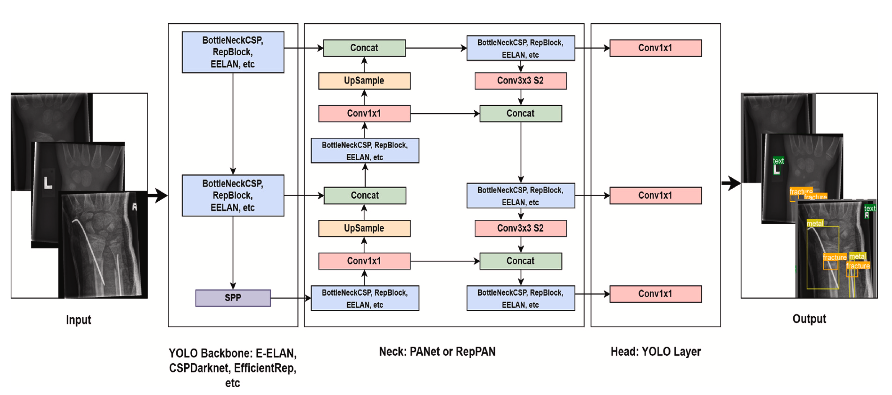
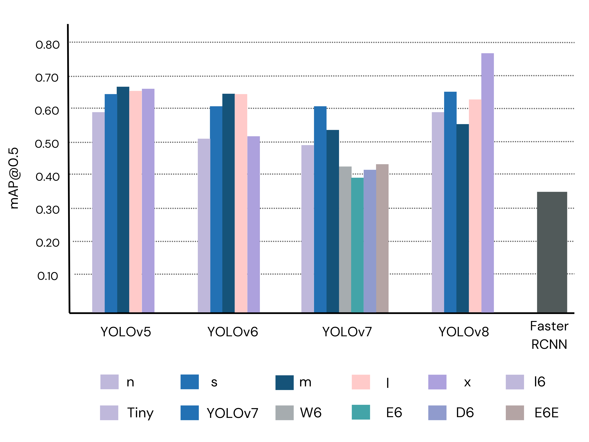

# Pediatric Wrist Abnormality Detection

conda activate python_3_10_16
flask --app app.py --debug run

## data 
[text](https://www.kaggle.com/datasets/jasonroggy/grazpedwri-dx)

[](https://paperswithcode.com/sota/object-detection-on-grazpedwri-dx?p=enhancing-wrist-abnormality-detection-with)



-------------------
Journal Paper URL: [Enhancing wrist abnormality detection with YOLO: Analysis of state-of-the-art single-stage detection models](https://www.sciencedirect.com/science/article/pii/S1746809424002027) 

----------------
Arxiv URL: [Enhancing Wrist Fracture Detection with YOLO](https://arxiv.org/abs/2407.12597)


## Installation

To run this machine learning project on Flask, you need to follow these steps:

1. Clone the project repository from GitHub:

```bash
git clone https://github.com/ammarlodhi255/pediatric_wrist_abnormality_detection-end-to-end-implementation.git
```

2. Navigate to the project directory:

```bash
cd pediatric_wrist_abnormality_detection-end-to-end-implementation
```

3. Create a virtual environment for the project:

```bash
python3 -m venv env
```

4. Activate the virtual environment:

```bash
source env/bin/activate
```

5. Install the required packages using pip:

```bash
pip install -r requirements.txt
```

6. Export the Flask app:

```bash
export FLASK_APP=app.py
```

7. Run the Flask app:

```bash
flask run
```

The app should now be running on your local machine. You can access it by opening a web browser and navigating to http://localhost:5000.

## Results

 We conducted a total of 23 detection procedures using different variants of each YOLO model and a two-stage detection model (Faster R-CNN) on a test set consisting of 1016 randomly selected samples. The performance of each model was evaluated using metrics such as precision, recall, and mean average precision (mAP).


<div align="center">
  
</div>
